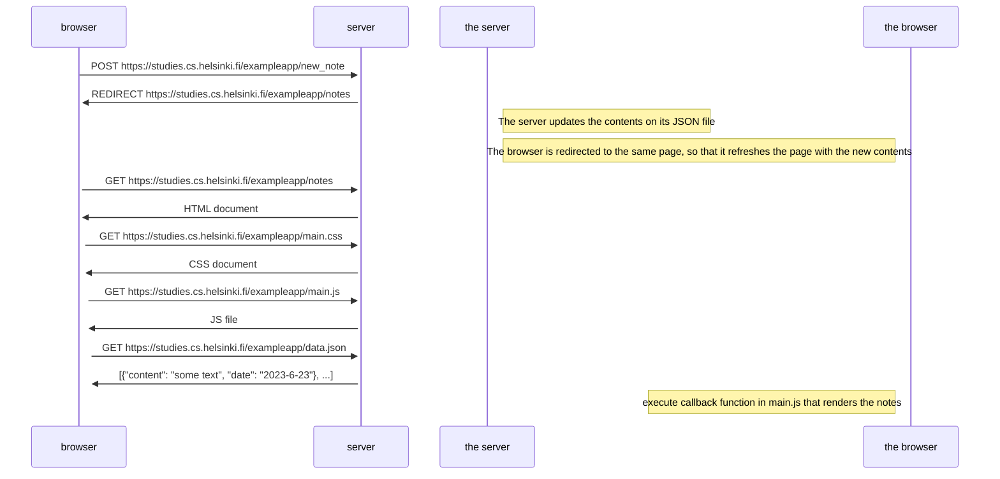

## This uses Mermaid language

```mermaid
sequenceDiagram
	participant browser
	participant server

	browser ->>+ server: POST https://studies.cs.helsinki.fi/exampleapp/new_note
	server ->>+ browser: REDIRECT https://studies.cs.helsinki.fi/exampleapp/notes

	Note right of the server: The server updates the contents on its JSON file
	Note left of the browser: The browser is redirected to the same page, so that it refreshes the page with the new contents

	browser ->>+ server: GET https://studies.cs.helsinki.fi/exampleapp/notes
	server ->>+ browser: HTML document

	browser ->>+ server: GET https://studies.cs.helsinki.fi/exampleapp/main.css
	server ->>+ browser: CSS document

	browser ->>+ server: GET https://studies.cs.helsinki.fi/exampleapp/main.js
	server ->>+ browser: JS file

	browser ->>+ server: GET https://studies.cs.helsinki.fi/exampleapp/data.json
	server ->>+ browser: [{"content": "some text", "date": "2023-6-23"}, ...]

	Note left of the browser: execute callback function in main.js that renders the notes
```