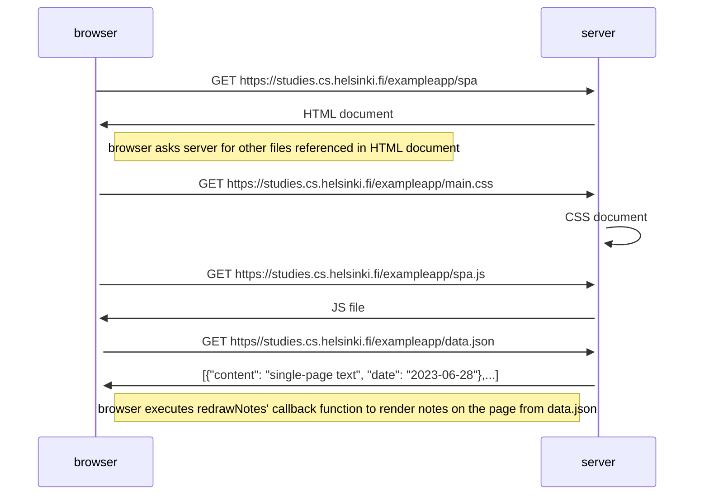

## This uses Mermaid lanugage

Sequence diagram for retreiving the single-page application version of ExampleApp.

```mermaid

sequenceDiagram

	browser ->>+ server: GET https://studies.cs.helsinki.fi/exampleapp/spa
	server ->>+ browser: HTML document

	Note right of browser: browser asks server for other files referenced in HTML document

	browser ->>+ server: GET https://studies.cs.helsinki.fi/exampleapp/main.css
	server ->>+ server: CSS document

	browser ->>+ server: GET https://studies.cs.helsinki.fi/exampleapp/spa.js
	server ->>+ browser: JS file

	browser ->>+ server: GET https//studies.cs.helsinki.fi/exampleapp/data.json
	server ->>+ browser: [{"content": "single-page text", "date": "2023-06-28"},...]

	Note right of browser: browser executes redrawNotes' callback function to render notes on the page from data.json

```